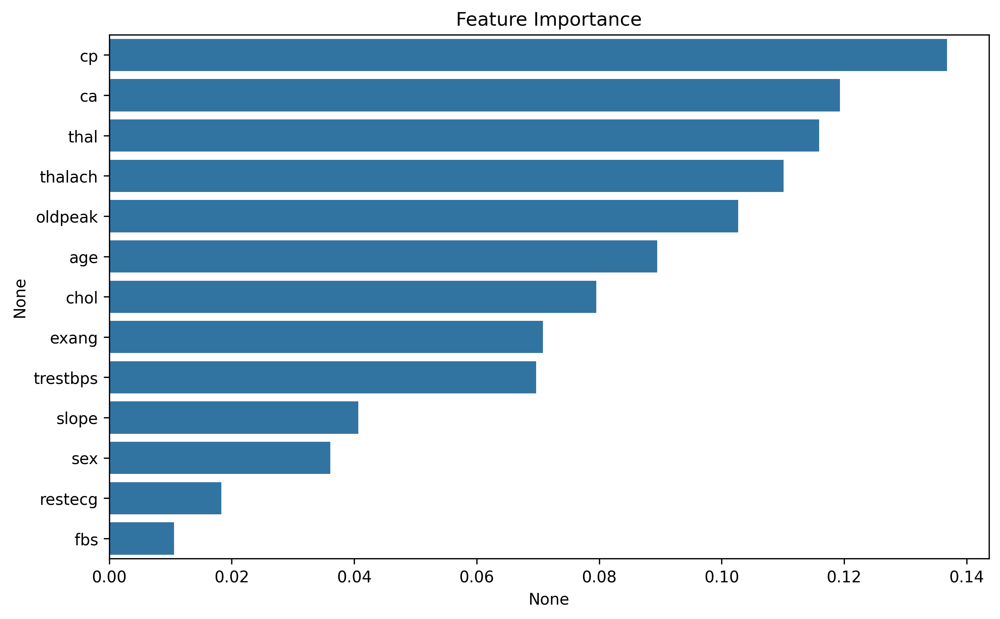

# 🫀 Heart Disease Detection System
**Decision Tree (ML) vs. Rule-Based Expert System (Experta)**

---

## 📊 1. Data Analysis & Insights
We analyzed the heart disease dataset to identify the most critical features. Below are the visual results generated from our analysis:

### 🔹 Correlation Analysis
This heatmap shows how features like `thal`, `exang`, and `cp` strongly correlate with heart disease.

### 🔹 Feature Importance
The Machine Learning model ranked the features based on their predictive power.

---

## 🤖 2. The Expert System (Rule-Based)
Built with **Experta**, this engine uses 10 clinical rules to assess risk.
- **Explainability:** 100% (Each risk level is tied to a specific medical rule).
- **Logic:** Forward Chaining.

---

## 🤖 3. Decision Tree Model (ML)
| Metric | Score | Analysis |
| :--- | :--- | :--- |
| **Accuracy** | 96.59% | Exceptional overall correctness. |
| **Recall (Sensitivity)** | **97.00%** | **Highly reliable for medical screening.** |
| **F1-Score** | 97.00% | Perfect balance between precision and recall. |
---

## 🖥️ 4. Interactive Dashboard
We built a Streamlit UI to allow users to input data and get instant results from both systems.

---

## 📂 Project Structure
- `data/`: Raw and Cleaned datasets.
- `ml_model/`: Model training scripts and `.pkl` files.
- `rule_based_system/`: Experta engine and medical rules.
- `ui/`: Streamlit web app and screenshots.
- `notebooks/`: Jupyter notebooks for EDA and Plotting.
- `reports/`: Accuracy comparison report.

## 🚀 How to Run
1. `pip install -r requirements.txt`
2. `streamlit run ui/app.py`

